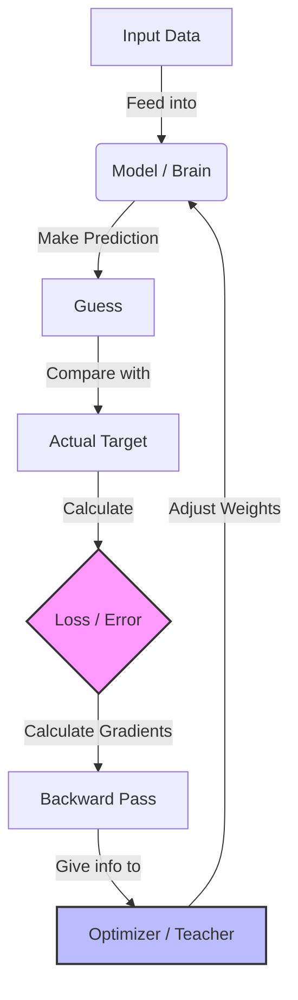

# AI Learning with Rust

This repository documents my journey learning Artificial Intelligence using the Rust programming language.

## Curriculum

### Phase 1: Foundations
Goal: Understand the math and basic building blocks without frameworks.
- [x] **Lesson 1: Tensors and Linear Regression**
    - Learned about `ndarray` for matrix operations.
    - Built a Linear Regression model "the hard way" (Manually implementing Forward Pass, Loss, and Gradient Descent).
    - Learned the function $y = 2x + 1$ successfully.

## Lessons

### Lesson 1: Tensors & Linear Regression (ndarray)
**Goal:** Understand the math "the hard way" (no frameworks) using `ndarray`.
- **Run:** `cargo run --bin activity1`
- **Concepts:** `ndarray`, Tensors, Forward Pass, MSE Loss, Gradient Descent.
- **Task:** Learn the function $y = 2x + 1$.

### Lesson 2: Linear Regression with Burn (Autodiff)
**Goal:** Implement Linear Regression using the **Burn** framework with automatic differentiation.
- **Run:** `cargo run --bin activity2`
- **Concepts:** `burn`, `wgpu`, `Autodiff`, Tensor Operations, Gradient Descent, Weights Update.
- **Task:** Predict **Memory Usage** based on **Session Duration** and **API Calls**.
  - Model: $Memory \approx w_1 \cdot Session + w_2 \cdot API + b$
  - Uses `Autodiff<Wgpu>` backend to compute gradients and update weights manualy.

### Lesson 3: The "Burn Way" (Modules & Optimizers)
**Goal:** Abstract away manual weight handling using Burn's high-level building blocks.
- **Run:** `cargo run --bin activity3`
- **Concepts:** `Module`, `Optimizer`, `LinearConfig`, `Adam`, `GradientsParams`.
- **Task:** Same prediction task as Lesson 2, but cleaner code.

#### How it works (Layman's Terms)
Instead of managing every single number (weight) manually, we wrap them in a **Module** (the "brain") and hire an **Optimizer** (the "teacher") to update them.

1.  **Forward Pass**: The model makes a guess based on the input.
2.  **Loss**: We measure how "wrong" the guess was (Error).
3.  **Backward Pass**: We calculate *how* to change the parameters to reduce the error.
4.  **Optimizer Step**: The optimizer automatically updates the model's internal weights using the gradients.

