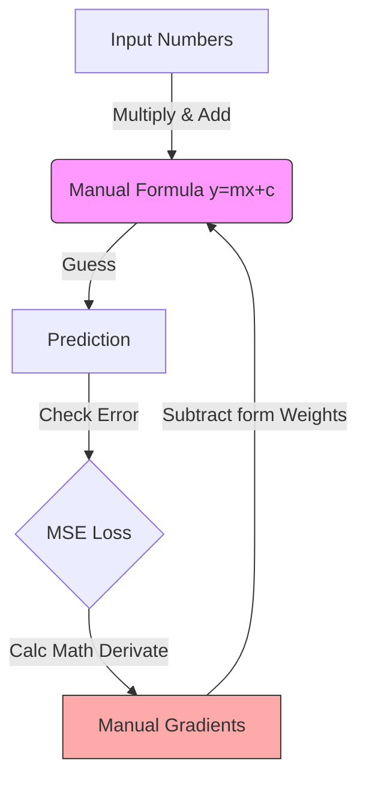
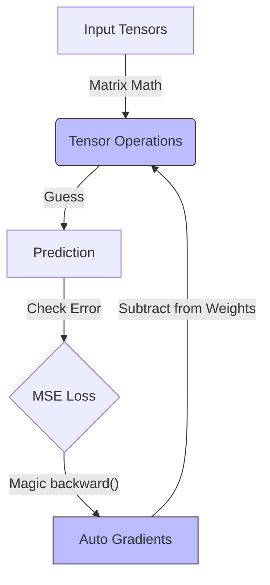
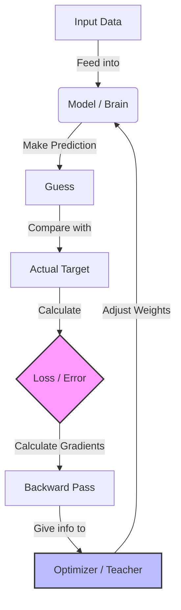
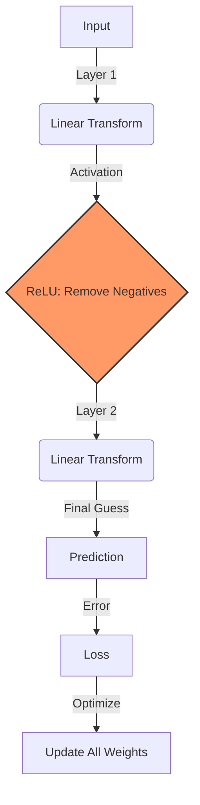
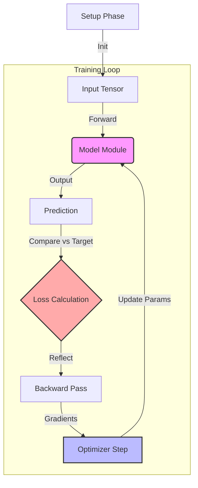
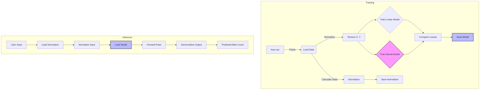
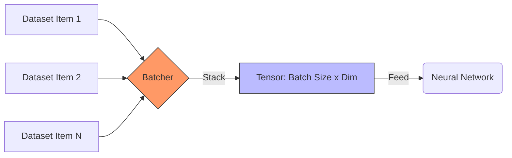
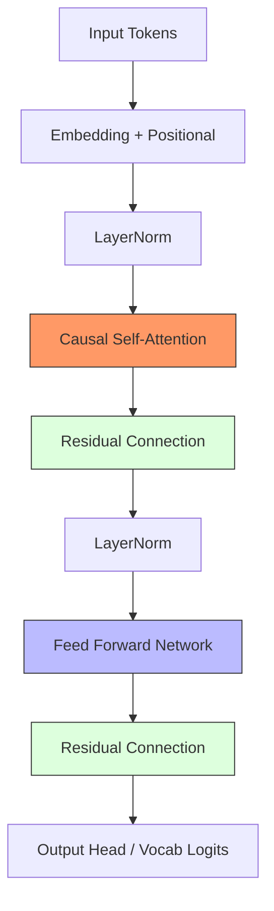

# AI Learning with Rust

This repository documents my journey learning Artificial Intelligence using the Rust programming language.

## Curriculum

### Phase 1: Foundations (No Frameworks)

Goal: Understand the math and basic building blocks from scratch.

- [x] **Lesson 1: Tensors and Linear Regression (ndarray)**
  - Built a Linear Regression model "the hard way".
  - Manually implemented Forward Pass, Loss (MSE), and Gradient Descent.

### Phase 2: Introduction to Burn Framework

Goal: Transition to a deep learning framework, learning its core primitives and modularity.

- [x] **Lesson 2: Linear Regression with Autodiff**
  - Introduced `burn` and `wgpu`.
  - Used Automatic Differentiation to replace manual gradient calculations.
- [x] **Lesson 3: The "Burn Way" (Modules & Optimizers)**
  - Abstracted weights into `Module`s.
  - Used `Optimizer`s (Adam) for automatic weight updates.
- [x] **Lesson 4: Neural Networks & Non-Linearity**
  - Introduced Hidden Layers and Activation Functions (`ReLU`).
  - Moved from simple linear regression to a basic Neural Network.
- [x] **Lesson 5: Putting it all together**
  - A minimal, complete example of a Neural Network training loop.
  - Switched backend to `NdArray` (CPU).
- [x] **Lesson 6: Real-World Data & CLI Tool**
  - Load and normalize CSV data (Bike Sharing Dataset).
  - Train Linear vs Neural models, compare losses.
  - GPU execution with WGPU, mini-batch training.
  - CLI tool for training and prediction.
- [x] **Lesson 7: Batched DataLoader & Training Loop**
  - Introduced `Batcher` and `DataLoader` for efficient data handling.
  - Implemented structured training loop with automatic shuffling.
  - Persistence of model weights and normalization stats.
  - GPU acceleration with WGPU.
- [x] **Lesson 8: Tiny GPT from Scratch**
  - Implemented a character-level decoder-only Transformer.
  - Multi-head causal self-attention with masking.
  - Autoregressive text generation with temperature sampling.
  - Model checkpointing and CLI for interaction.

## Lessons

### Lesson 1: Tensors & Linear Regression (ndarray)

**Goal:** Understand the math "the hard way" (no frameworks) using `ndarray`.

- **Run:** `cargo run --bin activity1`
- **Concepts:** `ndarray`, Tensors, Forward Pass, MSE Loss, Gradient Descent.
- **Task:** Learn the function $y = 2x + 1$.

#### Flow Chart (Layman's Terms)

We did everything manually:



### Lesson 2: Linear Regression with Burn (Autodiff)

**Goal:** Implement Linear Regression using the **Burn** framework with automatic differentiation.

- **Run:** `cargo run --bin activity2`
- **Concepts:** `burn`, `wgpu`, `Autodiff`, Tensor Operations, Gradient Descent, Weights Update.
- **Task:** Predict **Memory Usage** based on **Session Duration** and **API Calls**.
  - Model: $Memory \approx w_1 \cdot Session + w_2 \cdot API + b$
  - Uses `Autodiff<Wgpu>` backend to compute gradients and update weights manualy.

#### Flow Chart (Layman's Terms)

We stopped doing calculus manually, but still managed the weights ourselves.



### Lesson 3: The "Burn Way" (Modules & Optimizers)

**Goal:** Abstract away manual weight handling using Burn's high-level building blocks.

- **Run:** `cargo run --bin activity3`
- **Concepts:** `Module`, `Optimizer`, `LinearConfig`, `Adam`, `GradientsParams`.
- **Task:** Same prediction task as Lesson 2, but cleaner code.

#### Flow Chart (Layman's Terms)

Instead of managing every single number (weight) manually, we wrap them in a **Module** (the "brain") and hire an **Optimizer** (the "teacher") to update them.



1.  **Forward Pass**: The model makes a guess based on the input.
2.  **Loss**: We measure how "wrong" the guess was (Error).
3.  **Backward Pass**: We calculate _how_ to change the parameters to reduce the error.
4.  **Optimizer Step**: The optimizer automatically updates the model's internal weights using the gradients.

### Lesson 4: Neural Networks & Non-Linearity (ReLU)

**Goal:** Build a "real" Neural Network by introducing a hidden layer and non-linear activation.

- **Run:** `cargo run --bin activity4`
- **Concepts:** Hidden Layers, `ReLU` (Rectified Linear Unit), Modeling Non-Linear Relationships.
- **Task:** Predict memory usage with a smarter model.

#### Why do we need ReLU?

Previously, our models were just straight lines ($y = mx + b$). But real-world data is messy and curvy.

- **Hidden Layer:** Adds complexity to the model, allowing it to learn features.
- **ReLU:** Adds "non-linearity", allowing the model to bend and twist its predictions to fit complex patterns, rather than just drawing a straight line.

#### Flow Chart (Layman's Terms)

Now we add a "hidden" layer that processes the data before the final answer.



### Lesson 5: Putting it all together (Full Example)

**Goal:** A minimal, self-contained complete example of a Neural Network in Burn on CPU.

- **Run:** `cargo run --bin activity5`
- **Concepts:** Full pipeline review: Model, Autograd, Optimizer, Training Loop.
- **Task:** Solve an XOR-like problem.
- **Backend:** CPU (NdArray) by default to show flexibility.

#### Summary

This lesson serves as a "cheat sheet" or reference implementation that brings together:

1.  **Model Definition:** `#[derive(Module)]` with `Linear` and `ReLU`.
2.  **Autograd:** `loss.backward()` to compute gradients automatically.
3.  **Optimizer:** `Adam` to update weights.
4.  **Backend Switching:** Using `NdArray` (CPU) instead of Wgpu.

#### Flow Chart (The Full Cycle)

This diagram shows the complete lifecycle of a training step in Burn.



### Lesson 6: Real-World Data & CLI Tool (GPU)

**Goal:** Build a complete ML pipeline with real-world data, GPU execution, model checkpointing, and a CLI.

- **Run:** `cargo run --bin lesson6 -- train --dataset hour.csv --epochs 20`
- **Predict:** `cargo run --bin lesson6 -- predict --hr 17 --temp 0.44 --hum 0.82 --windspeed 0.28 --workingday 1`
- **Concepts:** CSV loading, Feature Normalization, Mini-Batch Training, Model Comparison, GPU (WGPU), Model Checkpointing, Clap CLI.
- **Task:** Predict bike sharing counts from weather/time features using the [UCI Bike Sharing Dataset](https://archive.ics.uci.edu/ml/datasets/bike+sharing+dataset).

#### Features Used

| Feature      | Description            |
| ------------ | ---------------------- |
| `hr`         | Hour of the day (0-23) |
| `temp`       | Normalized temperature |
| `hum`        | Normalized humidity    |
| `windspeed`  | Normalized wind speed  |
| `workingday` | Working day flag (0/1) |

#### Project Structure

```
src/activity/lesson6/
├── cli.rs      # Command-line argument parsing (Clap)
├── data.rs     # CSV loading, normalization, batching, save/load
├── model.rs    # Linear and Neural model definitions
├── train.rs    # Training loop, model saving
├── predict.rs  # Model loading, inference
└── main.rs     # Entry point, backend setup, CLI dispatch
```

#### Model Checkpointing

After training, the model and normalization parameters are saved to disk:

```
artifacts/
├── bike_model.mpk      # Trained Neural Model weights (MessagePack format)
└── normalizer.json     # Normalization parameters (mean, std, target_max)
```

This allows predictions to be made without re-training.

#### Usage Examples

```bash
# Train models and save to artifacts/
cargo run --bin lesson6 -- train --dataset hour.csv --epochs 50 --batch-size 64

# Make predictions using saved model
cargo run --bin lesson6 -- predict --hr 17 --temp 0.44 --hum 0.82 --windspeed 0.28 --workingday 1
# Output: Predicted bike count: 348

cargo run --bin lesson6 -- predict --hr 8 --temp 0.3 --hum 0.6 --windspeed 0.1 --workingday 1
# Output: Predicted bike count: ~200 (morning commute)
```

#### Flow Chart



### Lesson 7: Batched DataLoader & Training Loop (GPU)

**Goal:** Implement professional data loading and batching using Burn's `DataLoader` and `Batcher` traits.

- **Run Train:** `cargo run --bin activity7 -- train`
- **Run Predict:** `cargo run --bin activity7 -- predict --hr 10 --temp 0.5 --hum 0.5 --windspeed 0.1 --workingday 1.0`
- **Concepts:** `Batcher` Trait, `DataLoaderBuilder`, Mini-batching, Model Persistence, GPU (WGPU).

#### Why use a DataLoader?

In previous lessons, we manually handled slices of tensors. For large-scale AI, this doesn't scale. Burn's `DataLoader` provides:

1.  **Automatic Batching**: Uses a `Batcher` to stack individual samples into tensors.
2.  **Shuffling**: Randomizes the data every epoch to prevent the model from learning the sequence.
3.  **Efficiency**: Can pre-fetch data in the background (using multi-worker threads).

#### The Batching Process

The `Batcher` acts as a bridge between your raw dataset and the model input.



#### Saving & Loading

Lesson 7 separates training and prediction completely. It saves two files:

- `artifacts/lesson7/model.mpk`: The neural weights.
- `artifacts/lesson7/stats.json`: Normalization constants required to pre-process data for prediction.

#### Usage Example

```bash
# Train the model on your GPU
cargo run --bin activity7 -- train

# Predict using the saved weights
cargo run --bin activity7 -- predict --hr 8 --temp 0.2 --hum 0.8 --windspeed 0.2 --workingday 1
# Output: Predicted Bike Demand: ~180 units
```

### Lesson 8: Tiny GPT from Scratch (Decoder-only Transformer)

**Goal:** Understand the internal architecture of Large Language Models (LLMs) by building a "Tiny GPT" from the ground up.

- **Run Train:** `cargo run --bin lesson8 -- train`
- **Run Generate:** `cargo run --bin lesson8 -- generate --prompt "Learning Rust is "`
- **Concepts:** Tokenization (char-level), Causal Self-Attention, Positional Embeddings, Masking, Transformer Blocks, Pre-norm architecture, Autoregressive Generation, Temperature Sampling.

#### What is a Decoder-only Transformer?

A decoder-only transformer (like GPT-2/3/4) is designed to predict the **next token** in a sequence. It uses "Causal Attention," meaning it is restricted from looking at future tokens during training (otherwise it would just cheat by looking up the answer).

#### Key Components

1.  **Causal Masking**: A triangular mask that ensures token $i$ can only attend to tokens $0 \dots i$.
2.  **Multi-Head Attention**: Allows the model to focus on different parts of the text simultaneously (e.g., grammar, meaning, and context).
3.  **Feed Forward Network (FFN)**: Two linear layers with a ReLU activation that process each token independently.
4.  **Residual Connections & LayerNorm**: Critical for training deep networks without "exploding" or "vanishing" gradients.

#### Flow Chart (Transformer Block)



#### CLI Usage

The project includes a CLI for training and testing:

```bash
# 1. Train the model (saves to artifacts/lesson8/)
cargo run --bin lesson8 -- train

# 2. Generate text with a custom prompt
cargo run --bin lesson8 -- generate --prompt "Transformer models are " --length 100 --temperature 0.8
```

#### Why character-level?

For this learning project, we use individual characters as tokens (e.g., 'a', 'b', '!', ' ') rather than words. This keeps the vocabulary size tiny (~65-100 items), making it much faster to train on a single GPU while still demonstrating the "magic" of LLMs.
