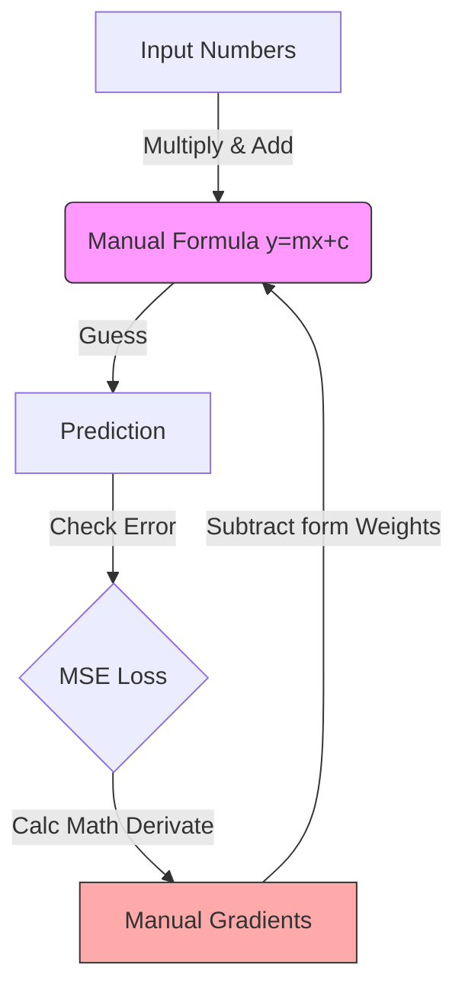
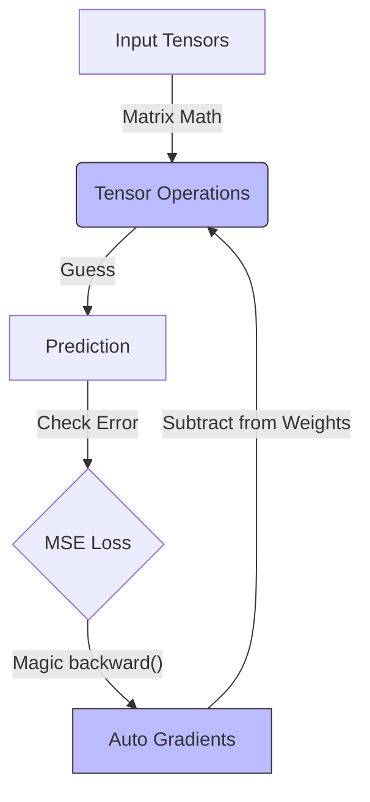
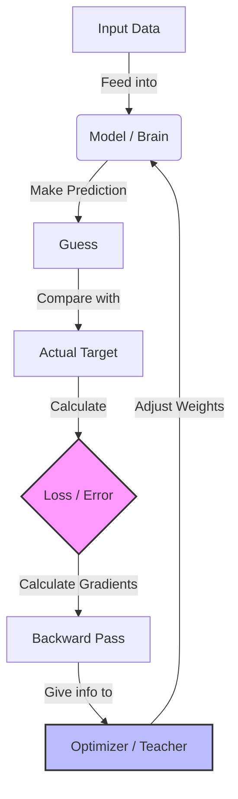
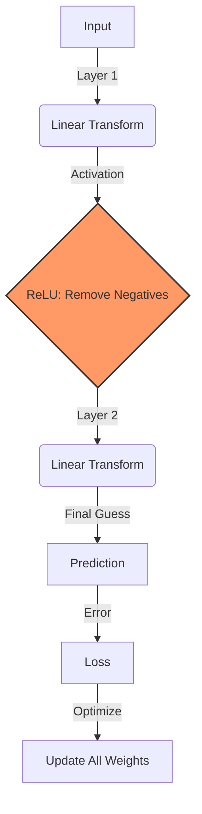
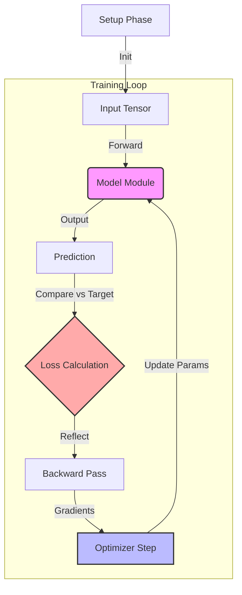

# AI Learning with Rust

This repository documents my journey learning Artificial Intelligence using the Rust programming language.

## Curriculum

### Phase 1: Foundations (No Frameworks)

Goal: Understand the math and basic building blocks from scratch.

- [x] **Lesson 1: Tensors and Linear Regression (ndarray)**
  - Built a Linear Regression model "the hard way".
  - Manually implemented Forward Pass, Loss (MSE), and Gradient Descent.

### Phase 2: Introduction to Burn Framework

Goal: Transition to a deep learning framework, learning its core primitives and modularity.

- [x] **Lesson 2: Linear Regression with Autodiff**
  - Introduced `burn` and `wgpu`.
  - Used Automatic Differentiation to replace manual gradient calculations.
- [x] **Lesson 3: The "Burn Way" (Modules & Optimizers)**
  - Abstracted weights into `Module`s.
  - Used `Optimizer`s (Adam) for automatic weight updates.
- [x] **Lesson 4: Neural Networks & Non-Linearity**
  - Introduced Hidden Layers and Activation Functions (`ReLU`).
  - Moved from simple linear regression to a basic Neural Network.
- [x] **Lesson 5: Putting it all together**
  - A minimal, complete example of a Neural Network training loop.
  - Switched backend to `NdArray` (CPU).

## Lessons

### Lesson 1: Tensors & Linear Regression (ndarray)

**Goal:** Understand the math "the hard way" (no frameworks) using `ndarray`.

- **Run:** `cargo run --bin activity1`
- **Concepts:** `ndarray`, Tensors, Forward Pass, MSE Loss, Gradient Descent.
- **Task:** Learn the function $y = 2x + 1$.

#### Flow Chart (Layman's Terms)

We did everything manually:

### Lesson 2: Linear Regression with Burn (Autodiff)

**Goal:** Implement Linear Regression using the **Burn** framework with automatic differentiation.

- **Run:** `cargo run --bin activity2`
- **Concepts:** `burn`, `wgpu`, `Autodiff`, Tensor Operations, Gradient Descent, Weights Update.
- **Task:** Predict **Memory Usage** based on **Session Duration** and **API Calls**.
  - Model: $Memory \approx w_1 \cdot Session + w_2 \cdot API + b$
  - Uses `Autodiff<Wgpu>` backend to compute gradients and update weights manualy.

#### Flow Chart (Layman's Terms)

We stopped doing calculus manually, but still managed the weights ourselves.

### Lesson 3: The "Burn Way" (Modules & Optimizers)

**Goal:** Abstract away manual weight handling using Burn's high-level building blocks.

- **Run:** `cargo run --bin activity3`
- **Concepts:** `Module`, `Optimizer`, `LinearConfig`, `Adam`, `GradientsParams`.
- **Task:** Same prediction task as Lesson 2, but cleaner code.

#### Flow Chart (Layman's Terms)

Instead of managing every single number (weight) manually, we wrap them in a **Module** (the "brain") and hire an **Optimizer** (the "teacher") to update them.

1.  **Forward Pass**: The model makes a guess based on the input.
2.  **Loss**: We measure how "wrong" the guess was (Error).
3.  **Backward Pass**: We calculate _how_ to change the parameters to reduce the error.
4.  **Optimizer Step**: The optimizer automatically updates the model's internal weights using the gradients.

### Lesson 4: Neural Networks & Non-Linearity (ReLU)

**Goal:** Build a "real" Neural Network by introducing a hidden layer and non-linear activation.

- **Run:** `cargo run --bin activity4`
- **Concepts:** Hidden Layers, `ReLU` (Rectified Linear Unit), Modeling Non-Linear Relationships.
- **Task:** Predict memory usage with a smarter model.

#### Why do we need ReLU?

Previously, our models were just straight lines ($y = mx + b$). But real-world data is messy and curvy.

- **Hidden Layer:** Adds complexity to the model, allowing it to learn features.
- **ReLU:** Adds "non-linearity", allowing the model to bend and twist its predictions to fit complex patterns, rather than just drawing a straight line.

#### Flow Chart (Layman's Terms)

Now we add a "hidden" layer that processes the data before the final answer.

### Lesson 5: Putting it all together (Full Example)

**Goal:** A minimal, self-contained complete example of a Neural Network in Burn on CPU.

- **Run:** `cargo run --bin activity5`
- **Concepts:** Full pipeline review: Model, Autograd, Optimizer, Training Loop.
- **Task:** Solve an XOR-like problem.
- **Backend:** CPU (NdArray) by default to show flexibility.

#### Summary

This lesson serves as a "cheat sheet" or reference implementation that brings together:

1.  **Model Definition:** `#[derive(Module)]` with `Linear` and `ReLU`.
2.  **Autograd:** `loss.backward()` to compute gradients automatically.
3.  **Optimizer:** `Adam` to update weights.
4.  **Backend Switching:** Using `NdArray` (CPU) instead of Wgpu.

#### Flow Chart (The Full Cycle)

This diagram shows the complete lifecycle of a training step in Burn.

